# CBT Mini Project ✅

Sistem Computer-Based Test (CBT) sederhana untuk institusi pendidikan — fokus pada manajemen sesi tes, soal, dan pelaporan.

---

## 📖 Deskripsi Singkat Aplikasi CBT

Aplikasi CBT (Computer-Based Test) ini dirancang untuk memfasilitasi ujian berbasis komputer di lingkungan pendidikan. Sistem ini memungkinkan administrator untuk mengelola soal, sesi tes, dan materi pelajaran, sementara siswa dapat mengikuti tes secara online dengan autentikasi yang aman. Fitur utama meliputi pembuatan soal pilihan ganda, pengumpulan jawaban otomatis, penilaian dasar, dan pelaporan hasil tes.

---

## 🔧 Tech Stack yang Digunakan

### Frontend
- **Next.js 14+**: Framework React untuk web aplikasi dengan SSR/SSG
- **TypeScript**: Untuk type safety dan pengembangan yang lebih robust
- **Chakra UI**: Komponen UI yang accessible dan responsif
- **React Hooks**: State management dan lifecycle management

### Backend
- **Go 1.21+**: Bahasa pemrograman utama untuk performa tinggi
- **gRPC**: Protokol komunikasi antar layanan dengan protobuf
- **REST Gateway**: Gateway untuk API RESTful dari gRPC
- **JWT**: Autentikasi berbasis token
- **GORM**: ORM untuk interaksi dengan database MySQL

### Database
- **MySQL**: Sistem manajemen basis data relasional
- **GORM**: Object-Relational Mapping untuk Go

---

## 🏗️ Arsitektur Sistem

Sistem ini menggunakan arsitektur **monolith** dengan komponen utama:
- **Backend Monolith**: Aplikasi Go tunggal yang menangani semua logika bisnis, API gRPC, dan REST gateway
- **Database Layer**: MySQL sebagai penyimpanan data utama
- **Frontend Layer**: Aplikasi Next.js yang berkomunikasi dengan backend via REST API
- **Deployment**: Containerized dengan Docker dan Docker Compose untuk kemudahan deployment

Arsitektur ini dipilih untuk kesederhanaan dalam pengembangan dan deployment pada skala kecil hingga menengah.

---

## ✨ Fitur Utama (Singkat)

- **Autentikasi**: login/logout untuk Siswa
- **Manajemen Sesi**: buat, mulai, dan akhiri sesi tes
- **Manajemen Soal**: CRUD soal (pilihan ganda & esai)
- **Pengumpulan Jawaban**: kirim jawaban dan penilaian otomatis dasar
- **Riwayat Siswa**: rekam hasil tes dan ringkasan skor
- **Monitoring**: tracing gRPC/HTTP, APM untuk performa dan error

---

## 🚀 Quick Start

1. Clone repo dan salin environment:

```powershell
git clone <repo-url>
cd cbt-mini-project
copy .env.example .env
```

2. Jalankan infrastruktur (Docker):

```powershell
cd deployment
docker-compose up -d
```

3. Jalankan backend:

```powershell
go run main.go
```

4. Jalankan frontend (opsional):

```powershell
cd web
npm install
npm run dev
```

> Tip: Pastikan MySQL berjalan dan `DB_DSN` di `.env` sesuai.

---

## 📌 API (Student)

**Autentikasi**

- `POST /v1/auth/login` — Login (body: `{email, password}`) → Response: `{token}`
- `POST /v1/auth/logout` — Logout (butuh Authorization)

**Student** (Header: `Authorization: Bearer <token>`)

- `GET /v1/test-sessions` — Daftar sesi tersedia
- `GET /v1/test-sessions/{id}` — Detail sesi
- `GET /v1/test-sessions/{id}/questions` — Ambil soal untuk sesi
- `POST /v1/test-sessions/{id}/submit` — Kirim jawaban (body: `{answers: [{nomorUrut, jawabanDipilih}]}`)
- `GET /v1/history` — Riwayat tes (siswa)

> Semua endpoint yang membutuhkan autentikasi menggunakan header: `Authorization: Bearer <token>`.

---

## 📋 API Documentation - Student Endpoints

Berikut adalah dokumentasi lengkap untuk endpoint siswa dengan contoh request dan response JSON:

### 1. POST /v1/auth/login - Login

**Request Body:**
```json
{
  "email": "student@example.com",
  "password": "securepassword123"
}
```

**Response (Success):**
```json
{
  "token": "eyJhbGciOiJIUzI1NiIsInR5cCI6IkpXVCJ9...",
  "refreshToken": "refresh_token_here",
  "user": {
    "id": 1,
    "email": "student@example.com",
    "nama": "John Doe",
    "role": "SISWA",
    "isActive": true,
    "createdAt": "2025-01-01T00:00:00Z",
    "updatedAt": "2025-01-01T00:00:00Z"
  },
  "expiresAt": "2025-12-22T12:00:00Z",
  "success": true,
  "message": "Login successful"
}
```

**Response (Error):**
```json
{
  "error": "Invalid credentials",
  "code": 401
}
```

### 2. GET /v1/test-sessions - Get Available Test Sessions

**Headers:**
```
Authorization: Bearer <jwt_token>
```

**Response (Success):**
```json
{
  "testSessions": [
    {
      "id": 1,
      "sessionToken": "sess_12345",
      "user": {
        "id": 1,
        "email": "student@example.com",
        "nama": "John Doe",
        "role": "SISWA",
        "isActive": true,
        "createdAt": "2025-01-01T00:00:00Z",
        "updatedAt": "2025-01-01T00:00:00Z"
      },
      "namaPeserta": "John Doe",
      "tingkat": {
        "id": 1,
        "nama": "Grade 10"
      },
      "mataPelajaran": {
        "id": 1,
        "nama": "Mathematics"
      },
      "waktuMulai": "2025-12-22T10:00:00Z",
      "waktuSelesai": "2025-12-22T11:00:00Z",
      "batasWaktu": "2025-12-22T11:00:00Z",
      "durasiMenit": 60,
      "nilaiAkhir": 0,
      "jumlahBenar": 0,
      "totalSoal": 20,
      "status": "ONGOING"
    }
  ],
  "pagination": {
    "page": 1,
    "pageSize": 10,
    "totalPages": 1,
    "totalRecords": 1
  }
}
```

### 3. GET /v1/test-sessions/{id} - Get Test Session Details

**Headers:**
```
Authorization: Bearer <jwt_token>
```

**Response (Success):**
```json
{
  "id": 1,
  "sessionToken": "sess_12345",
  "user": {
    "id": 1,
    "email": "student@example.com",
    "nama": "John Doe",
    "role": "SISWA",
    "isActive": true,
    "createdAt": "2025-01-01T00:00:00Z",
    "updatedAt": "2025-01-01T00:00:00Z"
  },
  "namaPeserta": "John Doe",
  "tingkat": {
    "id": 1,
    "nama": "Grade 10"
  },
  "mataPelajaran": {
    "id": 1,
    "nama": "Mathematics"
  },
  "waktuMulai": "2025-12-22T10:00:00Z",
  "waktuSelesai": "2025-12-22T11:00:00Z",
  "batasWaktu": "2025-12-22T11:00:00Z",
  "durasiMenit": 60,
  "nilaiAkhir": 0,
  "jumlahBenar": 0,
  "totalSoal": 20,
  "status": "ONGOING"
}
```

### 4. GET /v1/test-sessions/{id}/questions - Get Questions for Session

**Headers:**
```
Authorization: Bearer <jwt_token>
```

**Response (Success):**
```json
{
  "sessionToken": "sess_12345",
  "soal": [
    {
      "id": 1,
      "nomorUrut": 1,
      "pertanyaan": "What is 2 + 2?",
      "opsiA": "3",
      "opsiB": "4",
      "opsiC": "5",
      "opsiD": "6",
      "jawabanDipilih": "JAWABAN_INVALID",
      "isAnswered": false,
      "materi": {
        "id": 1,
        "nama": "Basic Arithmetic",
        "idMataPelajaran": 1,
        "idTingkat": 1,
        "isActive": true,
        "defaultDurasiMenit": 60,
        "defaultJumlahSoal": 20
      },
      "gambar": []
    }
  ],
  "totalSoal": 20,
  "currentNomorUrut": 1,
  "dijawabCount": 0,
  "isAnsweredStatus": [false, false, false, false, false, false, false, false, false, false, false, false, false, false, false, false, false, false, false, false],
  "batasWaktu": "2025-12-22T11:00:00Z"
}
```

### 5. POST /v1/test-sessions/{id}/submit - Submit Answers

**Headers:**
```
Authorization: Bearer <jwt_token>
```

**Request Body:**
```json
{
  "answers": [
    {
      "nomorUrut": 1,
      "jawabanDipilih": "B"
    },
    {
      "nomorUrut": 2,
      "jawabanDipilih": "A"
    }
  ]
}
```

**Response (Success):**
```json
{
  "sessionToken": "sess_12345",
  "submittedAnswers": [
    {
      "nomorUrut": 1,
      "jawabanDipilih": "B",
      "isCorrect": true,
      "dijawabPada": "2025-12-22T10:15:00Z"
    },
    {
      "nomorUrut": 2,
      "jawabanDipilih": "A",
      "isCorrect": false,
      "dijawabPada": "2025-12-22T10:20:00Z"
    }
  ],
  "totalScore": 50,
  "totalCorrect": 1,
  "totalQuestions": 2
}
```

### 6. GET /v1/history - Get Test History

**Headers:**
```
Authorization: Bearer <jwt_token>
```

**Response (Success):**
```json
{
  "history": [
    {
      "id": 1,
      "sessionToken": "sess_12345",
      "mataPelajaran": {
        "id": 1,
        "nama": "Mathematics"
      },
      "tingkat": {
        "id": 1,
        "nama": "Grade 10"
      },
      "waktuMulai": "2025-12-22T10:00:00Z",
      "waktuSelesai": "2025-12-22T10:45:00Z",
      "durasiPengerjaanDetik": 2700,
      "nilaiAkhir": 85,
      "jumlahBenar": 17,
      "totalSoal": 20,
      "status": "COMPLETED",
      "namaPeserta": "John Doe"
    }
  ],
  "pagination": {
    "page": 1,
    "pageSize": 10,
    "totalPages": 1,
    "totalRecords": 1
  },
  "rataRataNilai": 85,
  "totalTestCompleted": 1,
  "user": {
    "id": 1,
    "email": "student@example.com",
    "nama": "John Doe",
    "role": "SISWA",
    "isActive": true,
    "createdAt": "2025-01-01T00:00:00Z",
    "updatedAt": "2025-01-01T00:00:00Z"
  }
}
```

---

## 📊 Sequence Diagrams - Student Flows

Berikut adalah sequence diagrams terpisah untuk berbagai flow interaksi siswa dalam sistem CBT:


# CBT System - Sequence Diagrams

Dokumentasi lengkap sequence diagram untuk semua fitur CBT System.

----------

## 1. AUTENTIKASI

### 1.1 Login Flow

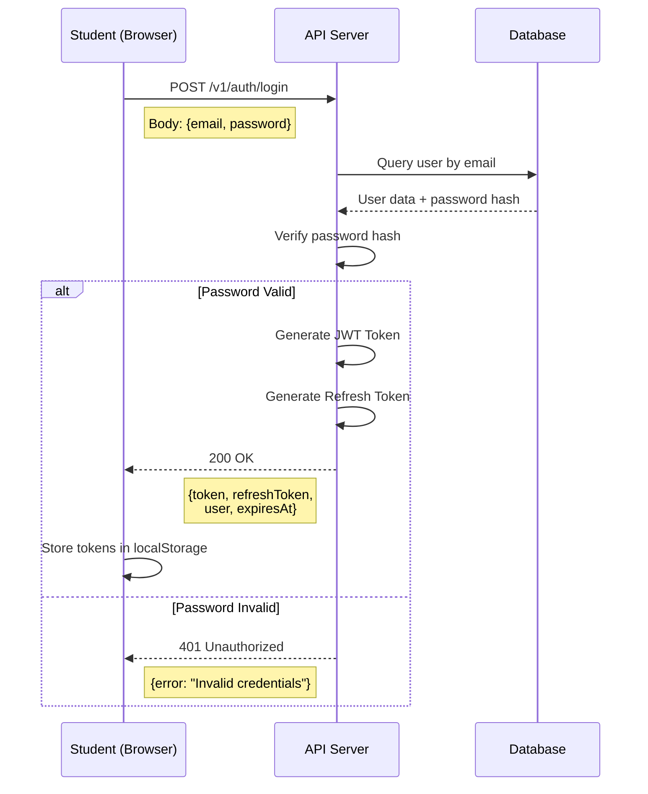
```mermaid
sequenceDiagram
    participant Student as Student (Browser)
    participant API as API Server
    participant DB as Database
    
    Student->>API: POST /v1/auth/login
    Note right of Student: Body: {email, password}
    
    API->>DB: Query user by email
    DB-->>API: User data + password hash
    
    API->>API: Verify password hash
    
    alt Password Valid
        API->>API: Generate JWT Token
        API->>API: Generate Refresh Token
        API-->>Student: 200 OK
        Note left of API: {token, refreshToken,<br/>user, expiresAt}
        Student->>Student: Store tokens in localStorage
    else Password Invalid
        API-->>Student: 401 Unauthorized
        Note left of API: {error: "Invalid credentials"}
    end

```

----------

### 1.2 Refresh Token Flow

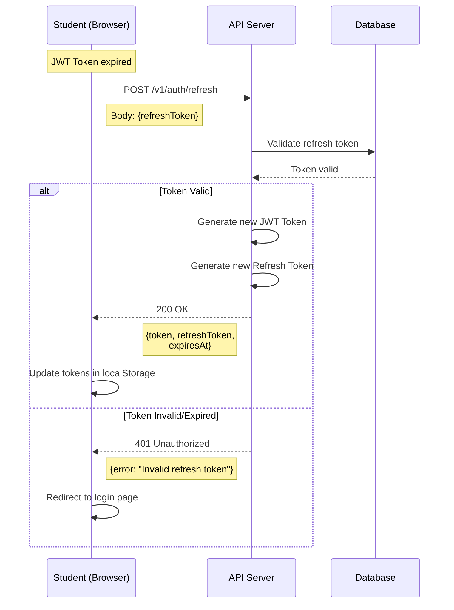
```mermaid
sequenceDiagram
    participant Student as Student (Browser)
    participant API as API Server
    participant DB as Database
    
    Note over Student: JWT Token expired
    
    Student->>API: POST /v1/auth/refresh
    Note right of Student: Body: {refreshToken}
    
    API->>DB: Validate refresh token
    DB-->>API: Token valid
    
    alt Token Valid
        API->>API: Generate new JWT Token
        API->>API: Generate new Refresh Token
        API-->>Student: 200 OK
        Note left of API: {token, refreshToken,<br/>expiresAt}
        Student->>Student: Update tokens in localStorage
    else Token Invalid/Expired
        API-->>Student: 401 Unauthorized
        Note left of API: {error: "Invalid refresh token"}
        Student->>Student: Redirect to login page
    end

```

----------

### 1.3 Get Profile Flow

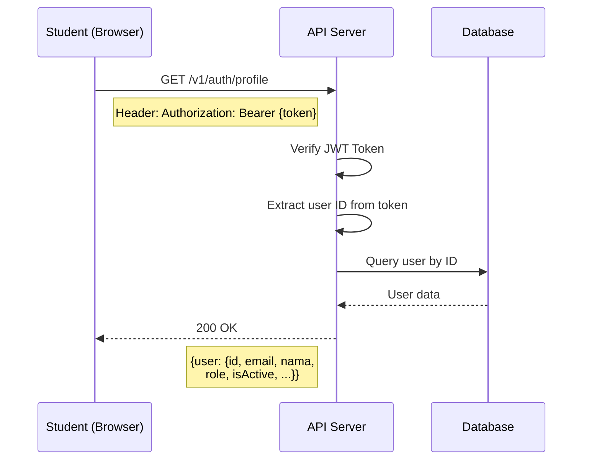
```mermaid
sequenceDiagram
    participant Student as Student (Browser)
    participant API as API Server
    participant DB as Database
    
    Student->>API: GET /v1/auth/profile
    Note right of Student: Header: Authorization: Bearer {token}
    
    API->>API: Verify JWT Token
    API->>API: Extract user ID from token
    
    API->>DB: Query user by ID
    DB-->>API: User data
    
    API-->>Student: 200 OK
    Note left of API: {user: {id, email, nama,<br/>role, isActive, ...}}

```

----------

## 2. TEST SESSION MANAGEMENT

### 2.1 Create Test Session (Start Exam)

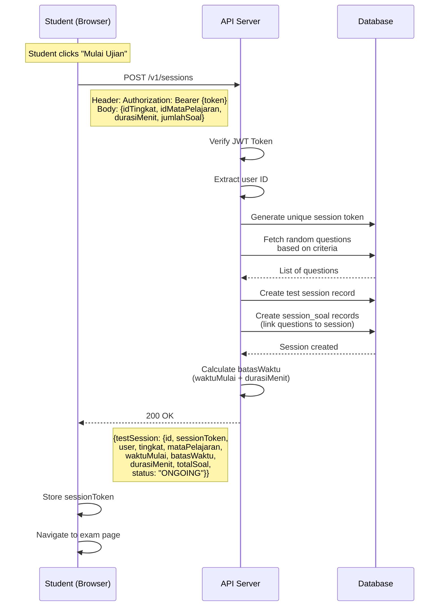
```mermaid
sequenceDiagram
    participant Student as Student (Browser)
    participant API as API Server
    participant DB as Database
    
    Note over Student: Student clicks "Mulai Ujian"
    
    Student->>API: POST /v1/sessions
    Note right of Student: Header: Authorization: Bearer {token}<br/>Body: {idTingkat, idMataPelajaran,<br/>durasiMenit, jumlahSoal}
    
    API->>API: Verify JWT Token
    API->>API: Extract user ID
    
    API->>DB: Generate unique session token
    API->>DB: Fetch random questions<br/>based on criteria
    DB-->>API: List of questions
    
    API->>DB: Create test session record
    API->>DB: Create session_soal records<br/>(link questions to session)
    DB-->>API: Session created
    
    API->>API: Calculate batasWaktu<br/>(waktuMulai + durasiMenit)
    
    API-->>Student: 200 OK
    Note left of API: {testSession: {id, sessionToken,<br/>user, tingkat, mataPelajaran,<br/>waktuMulai, batasWaktu,<br/>durasiMenit, totalSoal,<br/>status: "ONGOING"}}
    
    Student->>Student: Store sessionToken
    Student->>Student: Navigate to exam page

```

----------

### 2.2 Get Test Session Details

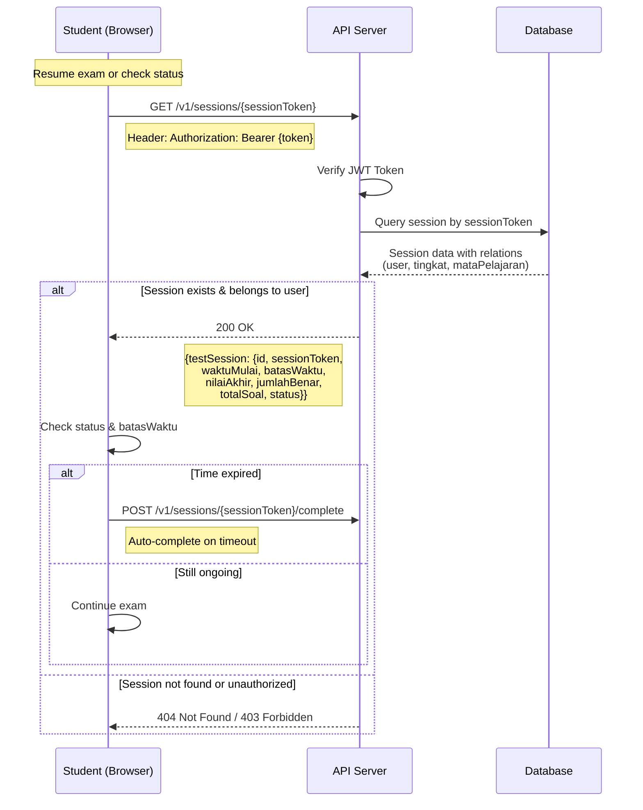
```mermaid
sequenceDiagram
    participant Student as Student (Browser)
    participant API as API Server
    participant DB as Database
    
    Note over Student: Resume exam or check status
    
    Student->>API: GET /v1/sessions/{sessionToken}
    Note right of Student: Header: Authorization: Bearer {token}
    
    API->>API: Verify JWT Token
    
    API->>DB: Query session by sessionToken
    DB-->>API: Session data with relations<br/>(user, tingkat, mataPelajaran)
    
    alt Session exists & belongs to user
        API-->>Student: 200 OK
        Note left of API: {testSession: {id, sessionToken,<br/>waktuMulai, batasWaktu,<br/>nilaiAkhir, jumlahBenar,<br/>totalSoal, status}}
        
        Student->>Student: Check status & batasWaktu
        
        alt Time expired
            Student->>API: POST /v1/sessions/{sessionToken}/complete
            Note right of Student: Auto-complete on timeout
        else Still ongoing
            Student->>Student: Continue exam
        end
    else Session not found or unauthorized
        API-->>Student: 404 Not Found / 403 Forbidden
    end

```

----------

### 2.3 Get Questions

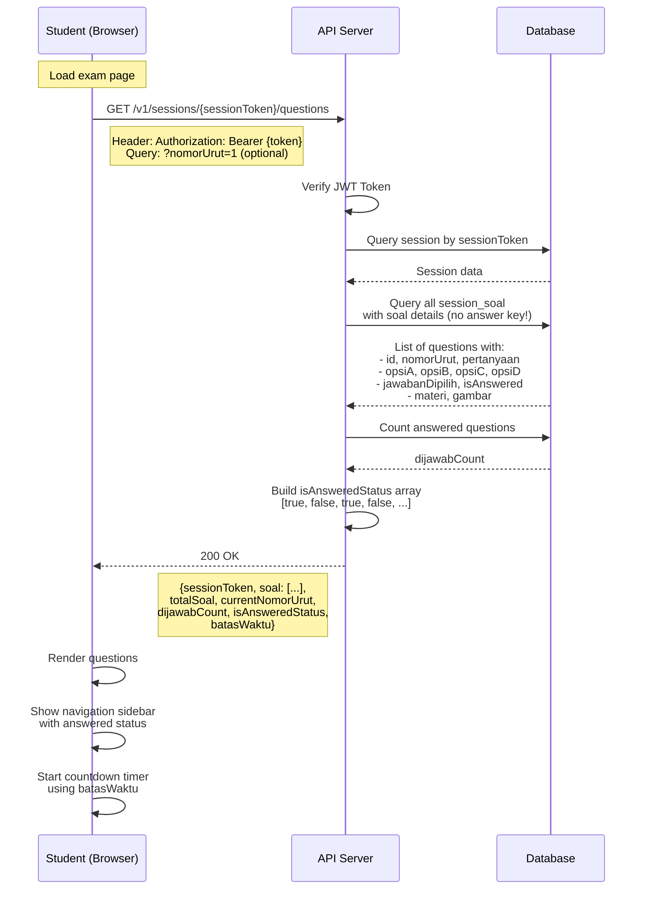
```mermaid
sequenceDiagram
    participant Student as Student (Browser)
    participant API as API Server
    participant DB as Database
    
    Note over Student: Load exam page
    
    Student->>API: GET /v1/sessions/{sessionToken}/questions
    Note right of Student: Header: Authorization: Bearer {token}<br/>Query: ?nomorUrut=1 (optional)
    
    API->>API: Verify JWT Token
    
    API->>DB: Query session by sessionToken
    DB-->>API: Session data
    
    API->>DB: Query all session_soal<br/>with soal details (no answer key!)
    DB-->>API: List of questions with:<br/>- id, nomorUrut, pertanyaan<br/>- opsiA, opsiB, opsiC, opsiD<br/>- jawabanDipilih, isAnswered<br/>- materi, gambar
    
    API->>DB: Count answered questions
    DB-->>API: dijawabCount
    
    API->>API: Build isAnsweredStatus array<br/>[true, false, true, false, ...]
    
    API-->>Student: 200 OK
    Note left of API: {sessionToken, soal: [...],<br/>totalSoal, currentNomorUrut,<br/>dijawabCount, isAnsweredStatus,<br/>batasWaktu}
    
    Student->>Student: Render questions
    Student->>Student: Show navigation sidebar<br/>with answered status
    Student->>Student: Start countdown timer<br/>using batasWaktu

```

----------

### 2.4 Submit Answer (Realtime)

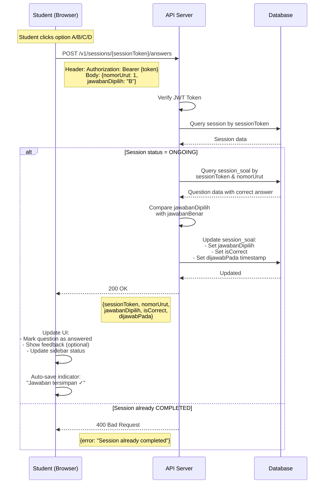
```mermaid
sequenceDiagram
    participant Student as Student (Browser)
    participant API as API Server
    participant DB as Database
    
    Note over Student: Student clicks option A/B/C/D
    
    Student->>API: POST /v1/sessions/{sessionToken}/answers
    Note right of Student: Header: Authorization: Bearer {token}<br/>Body: {nomorUrut: 1,<br/>jawabanDipilih: "B"}
    
    API->>API: Verify JWT Token
    
    API->>DB: Query session by sessionToken
    DB-->>API: Session data
    
    alt Session status = ONGOING
        API->>DB: Query session_soal by<br/>sessionToken & nomorUrut
        DB-->>API: Question data with correct answer
        
        API->>API: Compare jawabanDipilih<br/>with jawabanBenar
        
        API->>DB: Update session_soal:<br/>- Set jawabanDipilih<br/>- Set isCorrect<br/>- Set dijawabPada timestamp
        DB-->>API: Updated
        
        API-->>Student: 200 OK
        Note left of API: {sessionToken, nomorUrut,<br/>jawabanDipilih, isCorrect,<br/>dijawabPada}
        
        Student->>Student: Update UI:<br/>- Mark question as answered<br/>- Show feedback (optional)<br/>- Update sidebar status
        
        Student->>Student: Auto-save indicator:<br/>"Jawaban tersimpan ✓"
    else Session already COMPLETED
        API-->>Student: 400 Bad Request
        Note left of API: {error: "Session already completed"}
    end

```

----------

### 2.5 Clear Answer

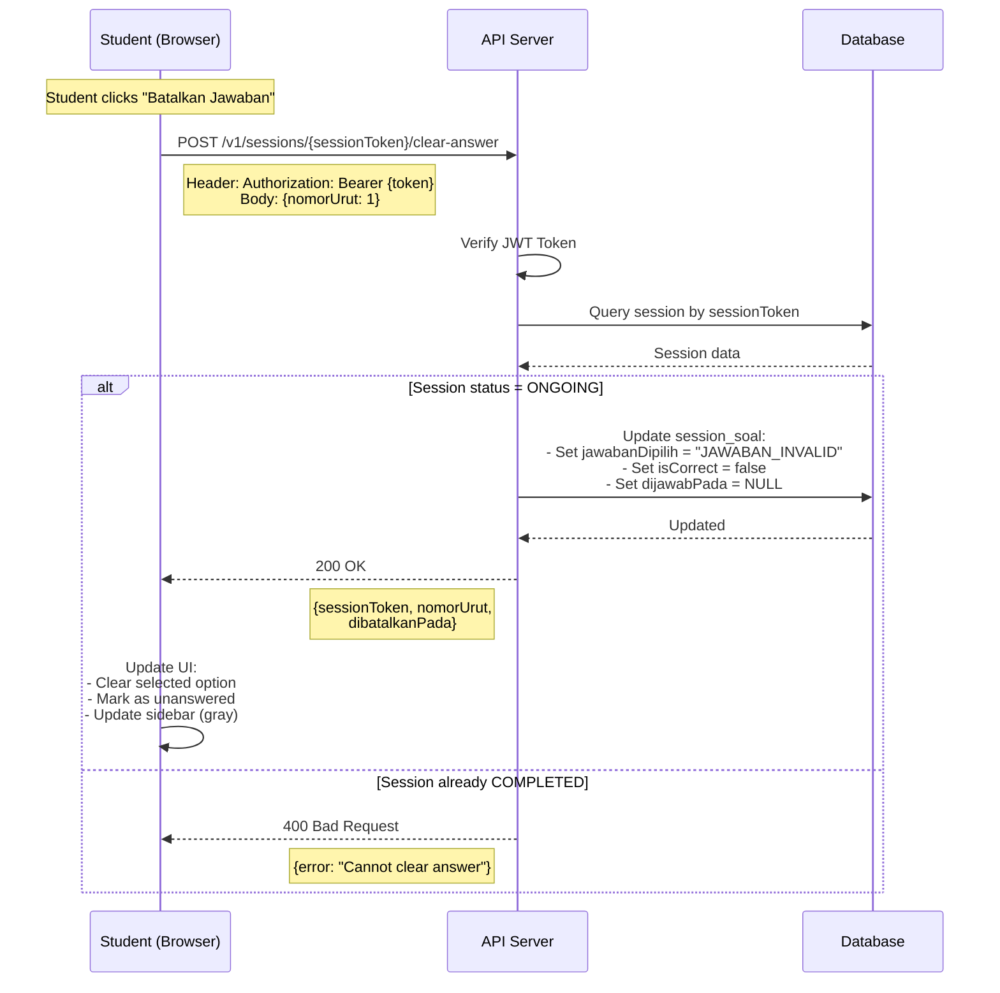
```mermaid
sequenceDiagram
    participant Student as Student (Browser)
    participant API as API Server
    participant DB as Database
    
    Note over Student: Student clicks "Batalkan Jawaban"
    
    Student->>API: POST /v1/sessions/{sessionToken}/clear-answer
    Note right of Student: Header: Authorization: Bearer {token}<br/>Body: {nomorUrut: 1}
    
    API->>API: Verify JWT Token
    
    API->>DB: Query session by sessionToken
    DB-->>API: Session data
    
    alt Session status = ONGOING
        API->>DB: Update session_soal:<br/>- Set jawabanDipilih = "JAWABAN_INVALID"<br/>- Set isCorrect = false<br/>- Set dijawabPada = NULL
        DB-->>API: Updated
        
        API-->>Student: 200 OK
        Note left of API: {sessionToken, nomorUrut,<br/>dibatalkanPada}
        
        Student->>Student: Update UI:<br/>- Clear selected option<br/>- Mark as unanswered<br/>- Update sidebar (gray)
    else Session already COMPLETED
        API-->>Student: 400 Bad Request
        Note left of API: {error: "Cannot clear answer"}
    end

```

----------

### 2.6 Complete Session (Finish Exam)

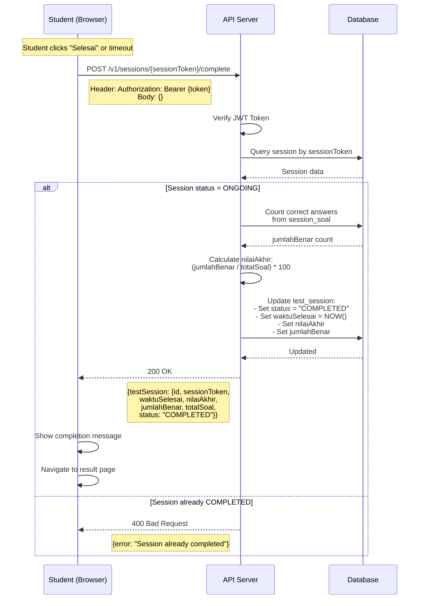
```mermaid
sequenceDiagram
    participant Student as Student (Browser)
    participant API as API Server
    participant DB as Database
    
    Note over Student: Student clicks "Selesai" or timeout
    
    Student->>API: POST /v1/sessions/{sessionToken}/complete
    Note right of Student: Header: Authorization: Bearer {token}<br/>Body: {}
    
    API->>API: Verify JWT Token
    
    API->>DB: Query session by sessionToken
    DB-->>API: Session data
    
    alt Session status = ONGOING
        API->>DB: Count correct answers<br/>from session_soal
        DB-->>API: jumlahBenar count
        
        API->>API: Calculate nilaiAkhir:<br/>(jumlahBenar / totalSoal) * 100
        
        API->>DB: Update test_session:<br/>- Set status = "COMPLETED"<br/>- Set waktuSelesai = NOW()<br/>- Set nilaiAkhir<br/>- Set jumlahBenar
        DB-->>API: Updated
        
        API-->>Student: 200 OK
        Note left of API: {testSession: {id, sessionToken,<br/>waktuSelesai, nilaiAkhir,<br/>jumlahBenar, totalSoal,<br/>status: "COMPLETED"}}
        
        Student->>Student: Show completion message
        Student->>Student: Navigate to result page
    else Session already COMPLETED
        API-->>Student: 400 Bad Request
        Note left of API: {error: "Session already completed"}
    end

```

----------

### 2.7 Get Test Result

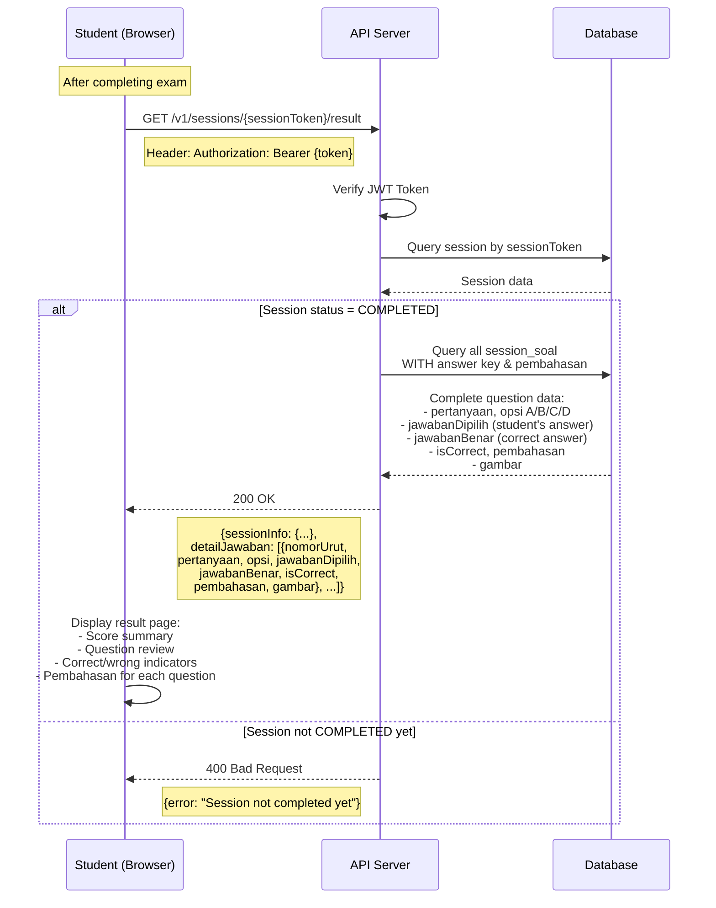
```mermaid
sequenceDiagram
    participant Student as Student (Browser)
    participant API as API Server
    participant DB as Database
    
    Note over Student: After completing exam
    
    Student->>API: GET /v1/sessions/{sessionToken}/result
    Note right of Student: Header: Authorization: Bearer {token}
    
    API->>API: Verify JWT Token
    
    API->>DB: Query session by sessionToken
    DB-->>API: Session data
    
    alt Session status = COMPLETED
        API->>DB: Query all session_soal<br/>WITH answer key & pembahasan
        DB-->>API: Complete question data:<br/>- pertanyaan, opsi A/B/C/D<br/>- jawabanDipilih (student's answer)<br/>- jawabanBenar (correct answer)<br/>- isCorrect, pembahasan<br/>- gambar
        
        API-->>Student: 200 OK
        Note left of API: {sessionInfo: {...},<br/>detailJawaban: [{nomorUrut,<br/>pertanyaan, opsi, jawabanDipilih,<br/>jawabanBenar, isCorrect,<br/>pembahasan, gambar}, ...]}
        
        Student->>Student: Display result page:<br/>- Score summary<br/>- Question review<br/>- Correct/wrong indicators<br/>- Pembahasan for each question
    else Session not COMPLETED yet
        API-->>Student: 400 Bad Request
        Note left of API: {error: "Session not completed yet"}
    end

```

----------

## 3. HISTORY

### 3.1 Get Student History

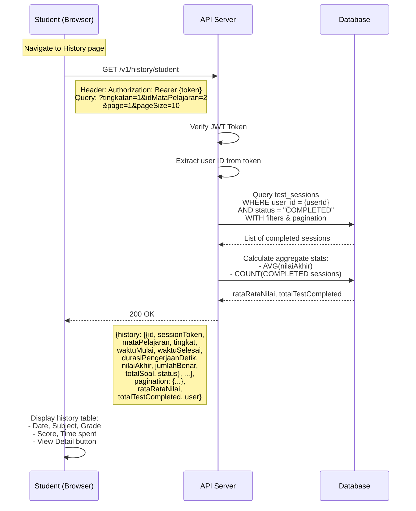
```mermaid
sequenceDiagram
    participant Student as Student (Browser)
    participant API as API Server
    participant DB as Database
    
    Note over Student: Navigate to History page
    
    Student->>API: GET /v1/history/student
    Note right of Student: Header: Authorization: Bearer {token}<br/>Query: ?tingkatan=1&idMataPelajaran=2<br/>&page=1&pageSize=10
    
    API->>API: Verify JWT Token
    API->>API: Extract user ID from token
    
    API->>DB: Query test_sessions<br/>WHERE user_id = {userId}<br/>AND status = "COMPLETED"<br/>WITH filters & pagination
    DB-->>API: List of completed sessions
    
    API->>DB: Calculate aggregate stats:<br/>- AVG(nilaiAkhir)<br/>- COUNT(COMPLETED sessions)
    DB-->>API: rataRataNilai, totalTestCompleted
    
    API-->>Student: 200 OK
    Note left of API: {history: [{id, sessionToken,<br/>mataPelajaran, tingkat,<br/>waktuMulai, waktuSelesai,<br/>durasiPengerjaanDetik,<br/>nilaiAkhir, jumlahBenar,<br/>totalSoal, status}, ...],<br/>pagination: {...},<br/>rataRataNilai,<br/>totalTestCompleted, user}
    
    Student->>Student: Display history table:<br/>- Date, Subject, Grade<br/>- Score, Time spent<br/>- View Detail button

```

----------

### 3.2 Get History Detail

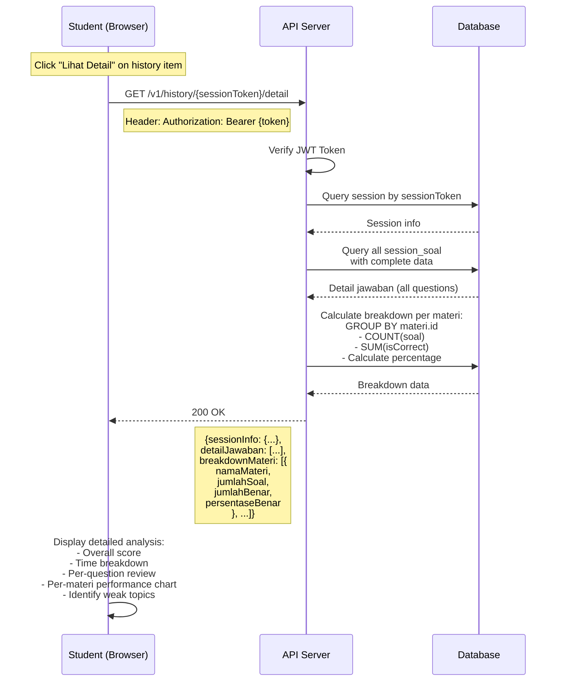
```mermaid
sequenceDiagram
    participant Student as Student (Browser)
    participant API as API Server
    participant DB as Database
    
    Note over Student: Click "Lihat Detail" on history item
    
    Student->>API: GET /v1/history/{sessionToken}/detail
    Note right of Student: Header: Authorization: Bearer {token}
    
    API->>API: Verify JWT Token
    
    API->>DB: Query session by sessionToken
    DB-->>API: Session info
    
    API->>DB: Query all session_soal<br/>with complete data
    DB-->>API: Detail jawaban (all questions)
    
    API->>DB: Calculate breakdown per materi:<br/>GROUP BY materi.id<br/>- COUNT(soal)<br/>- SUM(isCorrect)<br/>- Calculate percentage
    DB-->>API: Breakdown data
    
    API-->>Student: 200 OK
    Note left of API: {sessionInfo: {...},<br/>detailJawaban: [...],<br/>breakdownMateri: [{<br/>  namaMateri,<br/>  jumlahSoal,<br/>  jumlahBenar,<br/>  persentaseBenar<br/>}, ...]}
    
    Student->>Student: Display detailed analysis:<br/>- Overall score<br/>- Time breakdown<br/>- Per-question review<br/>- Per-materi performance chart<br/>- Identify weak topics

```

----------

## 4. COMPLETE USER JOURNEY

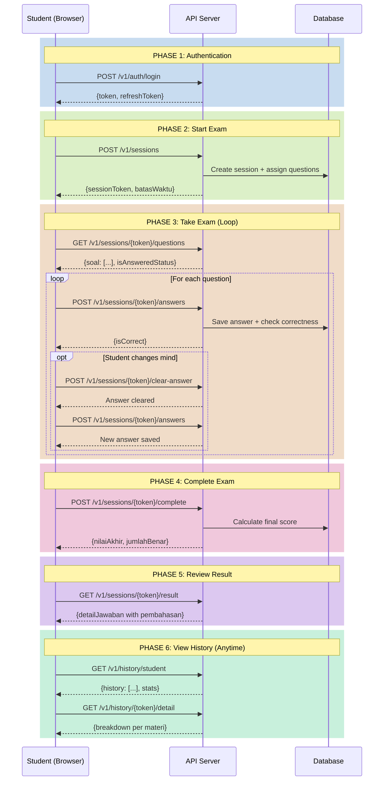
```mermaid
sequenceDiagram
    participant Student as Student (Browser)
    participant API as API Server
    participant DB as Database
    
    rect rgb(200, 220, 240)
    Note over Student,DB: PHASE 1: Authentication
    Student->>API: POST /v1/auth/login
    API-->>Student: {token, refreshToken}
    end
    
    rect rgb(220, 240, 200)
    Note over Student,DB: PHASE 2: Start Exam
    Student->>API: POST /v1/sessions
    API->>DB: Create session + assign questions
    API-->>Student: {sessionToken, batasWaktu}
    end
    
    rect rgb(240, 220, 200)
    Note over Student,DB: PHASE 3: Take Exam (Loop)
    Student->>API: GET /v1/sessions/{token}/questions
    API-->>Student: {soal: [...], isAnsweredStatus}
    
    loop For each question
        Student->>API: POST /v1/sessions/{token}/answers
        API->>DB: Save answer + check correctness
        API-->>Student: {isCorrect}
        
        opt Student changes mind
            Student->>API: POST /v1/sessions/{token}/clear-answer
            API-->>Student: Answer cleared
            Student->>API: POST /v1/sessions/{token}/answers
            API-->>Student: New answer saved
        end
    end
    end
    
    rect rgb(240, 200, 220)
    Note over Student,DB: PHASE 4: Complete Exam
    Student->>API: POST /v1/sessions/{token}/complete
    API->>DB: Calculate final score
    API-->>Student: {nilaiAkhir, jumlahBenar}
    end
    
    rect rgb(220, 200, 240)
    Note over Student,DB: PHASE 5: Review Result
    Student->>API: GET /v1/sessions/{token}/result
    API-->>Student: {detailJawaban with pembahasan}
    end
    
    rect rgb(200, 240, 220)
    Note over Student,DB: PHASE 6: View History (Anytime)
    Student->>API: GET /v1/history/student
    API-->>Student: {history: [...], stats}
    
    Student->>API: GET /v1/history/{token}/detail
    API-->>Student: {breakdown per materi}
    end

```

----------

## 5. ERROR HANDLING FLOWS

### 5.1 Token Expired During Exam

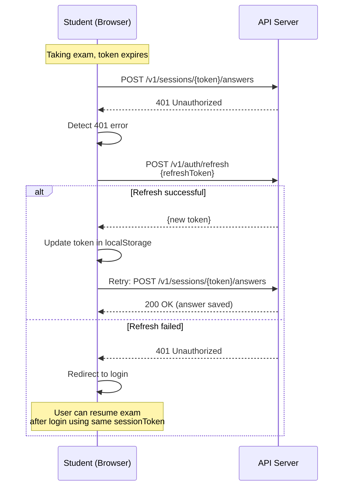
```mermaid
sequenceDiagram
    participant Student as Student (Browser)
    participant API as API Server
    
    Note over Student: Taking exam, token expires
    
    Student->>API: POST /v1/sessions/{token}/answers
    API-->>Student: 401 Unauthorized
    
    Student->>Student: Detect 401 error
    Student->>API: POST /v1/auth/refresh<br/>{refreshToken}
    
    alt Refresh successful
        API-->>Student: {new token}
        Student->>Student: Update token in localStorage
        Student->>API: Retry: POST /v1/sessions/{token}/answers
        API-->>Student: 200 OK (answer saved)
    else Refresh failed
        API-->>Student: 401 Unauthorized
        Student->>Student: Redirect to login
        Note over Student: User can resume exam<br/>after login using same sessionToken
    end

```

----------

### 5.2 Timeout During Exam

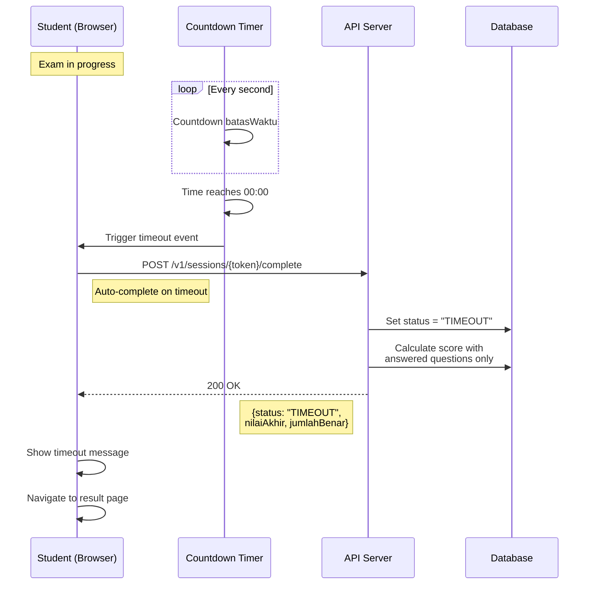
```mermaid
sequenceDiagram
    participant Student as Student (Browser)
    participant Timer as Countdown Timer
    participant API as API Server
    participant DB as Database
    
    Note over Student: Exam in progress
    
    loop Every second
        Timer->>Timer: Countdown batasWaktu
    end
    
    Timer->>Timer: Time reaches 00:00
    
    Timer->>Student: Trigger timeout event
    
    Student->>API: POST /v1/sessions/{token}/complete
    Note right of Student: Auto-complete on timeout
    
    API->>DB: Set status = "TIMEOUT"
    API->>DB: Calculate score with<br/>answered questions only
    
    API-->>Student: 200 OK
    Note left of API: {status: "TIMEOUT",<br/>nilaiAkhir, jumlahBenar}
    
    Student->>Student: Show timeout message
    Student->>Student: Navigate to result page

```

----------

### 5.3 Network Error During Submit

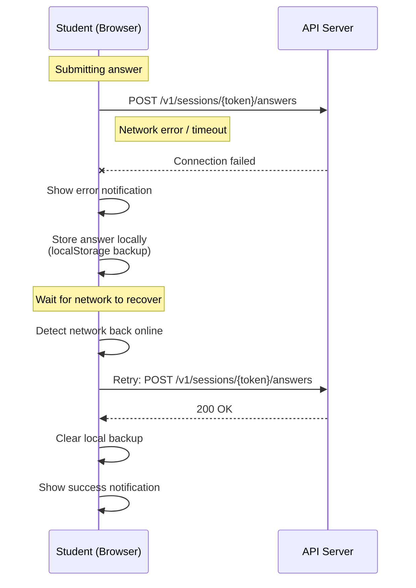
```mermaid
sequenceDiagram
    participant Student as Student (Browser)
    participant API as API Server
    
    Note over Student: Submitting answer
    
    Student->>API: POST /v1/sessions/{token}/answers
    Note right of Student: Network error / timeout
    
    API--XStudent: Connection failed
    
    Student->>Student: Show error notification
    Student->>Student: Store answer locally<br/>(localStorage backup)
    
    Note over Student: Wait for network to recover
    
    Student->>Student: Detect network back online
    
    Student->>API: Retry: POST /v1/sessions/{token}/answers
    API-->>Student: 200 OK
    
    Student->>Student: Clear local backup
    Student->>Student: Show success notification

```

----------

## CATATAN IMPLEMENTASI

### Best Practices:

1.  **Auto-save answers**: Submit immediately saat user pilih opsi
2.  **Offline backup**: Simpan jawaban di localStorage sebagai backup
3.  **Token refresh**: Handle 401 errors dengan auto-refresh
4.  **Timer synchronization**: Sync timer dengan server time (batasWaktu)
5.  **Optimistic UI**: Update UI dulu, rollback jika error
6.  **Error recovery**: Retry mechanism untuk network errors
7.  **Session persistence**: Gunakan sessionToken untuk resume exam

### Security Considerations:

1.  Semua endpoints kecuali login butuh JWT token
2.  Verify sessionToken belongs to authenticated user
3.  Prevent answer submission after timeout/complete
4.  Hide correct answers until session completed
5.  Rate limiting untuk prevent spam submissions

## 🧰 Pengembangan & Struktur

- Entry: `main.go`
- Inisialisasi: `init/`
- Logika bisnis: `internal/` (entities, handlers, usecases)
- Frontend: `web/`
- DB migration: `databases/migration`

---

## ⚙️ Variabel Lingkungan (penting)

- DB_DSN (contoh: `root:root@tcp(localhost:3306)/cbt_test`)
- GRPC_PORT (default: `6000`)
- REST_PORT (default: `8080`)
- JWT_SECRET
- ELASTIC_APM_SERVER_URL

---

## 🙋 Kontribusi & Lisensi

- Contributions: buka issue atau PR sederhana; sertakan deskripsi singkat.
- Lisensi: MIT

---

Butuh versi lain (lebih ringkas atau lebih teknis)? Katakan preferensinya dan aku sesuaikan.
